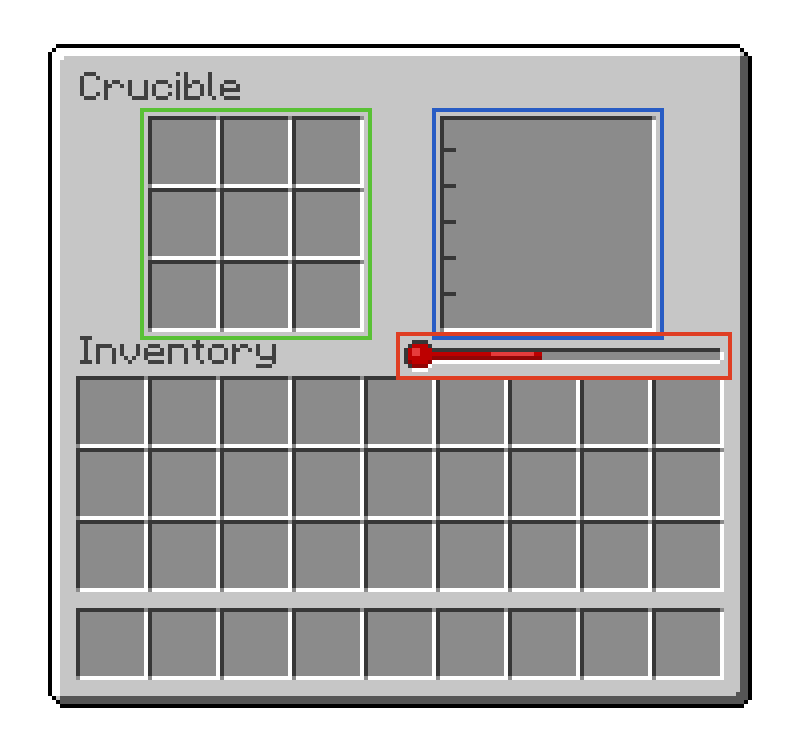

---
navigation:
  title: "Crucible"
  icon: "indref:ceramic_crucible_controller"
  parent: indref:primitive_age.md
  position: 4
item_ids:
  - indref:terracotta_bricks
  - indref:terracotta_brick_slab
  - indref:iron_fence
  - indref:ceramic_crucible_controller
---

# Ceramic Crucible

<GameScene zoom="3" interactive={true} fullWidth={true}>
    <MultiblockShape multiblock="indref:crucible_ceramic" direction="west"> </MultiblockShape>
</GameScene>

- **Not Rotatable**
- **Static Size**

The crucible is a multiblock used for all kinds of ore and metal processing.
The multiblock requires heat from below, that's why it is recommended to build it on top of a <ItemImage id="indref:firebox_controller" scale="0.6" /> [Refractory Firebox](./firebox.md#refractory-firebox)

<Row>

<Column  alignItems="center">

- <Color id="red"> Heat meter, displays the current heat stored </Color>

- <Color id="blue"> Fluid Tank, displays the currently stored molten metal </Color>

- <Color id="green"> Input Slots, for inserting items manually </Color>

</Column>

</Row>

The heat as well as the time required for a crucible recipe are available through JEI.
Once there is enough heat input items will start to melt.
This is indicated by a small vertical orange bar on the item.

Items can also be inserted by throwing them into the crucible from the top.
Just be careful that they don't despawn.

**WARNING** - Standing in the crucible will burn the player or any living entities

Once the crucible has filled with molten metal, it can be cast out into a casting basin.
To turn the crucible, power the crucible by supplying a redstone signal to the bottom of the crucible, for example through a <ItemImage id="minecraft:lever" scale="0.6" /> **Lever**.

To cast out your metals look at the [Casting](./casting.md) entry.

<GameScene zoom="3" interactive={true} fullWidth={true}>
    <MultiblockShape multiblock="indref:crucible_ceramic" unformed={false} showController={false} direction="west"> </MultiblockShape>
    <Block id="minecraft:lever" x="1" y="0" z="-2" p:face="floor" p:facing="east" p:powered="false" />
    <Block id="indref:ceramic_casting_basin" x="2" z="0" />
</GameScene>
