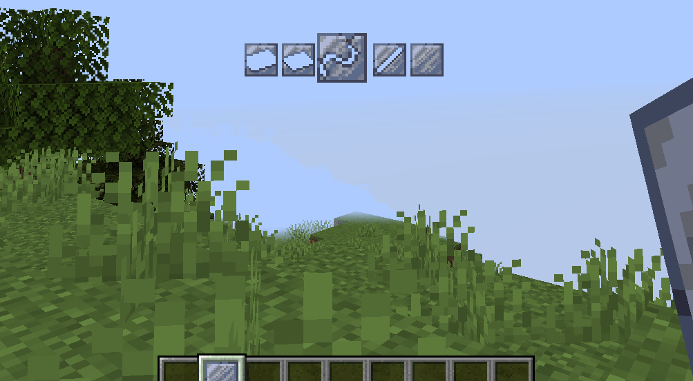

---
navigation:
  title: "Molds"
  icon: "indref:clay_mold_ingot"
  parent: indref:primitive_age.md
  position: 5
item_ids:
  - indref:clay_mold
  - indref:clay_mold_ingot
  - indref:clay_mold_wire
  - indref:clay_mold_rod
  - indref:clay_mold_plate
  - indref:steel_mold_ingot
  - indref:steel_mold_plate
  - indref:steel_mold_wire
  - indref:steel_mold_rod
---

# Casting Molds

## Clay Molds

Clay Molds are the first mold that can be used for casting.
Since they are only made of clay, they are rather easily destroyed, hence you can only use them once before having to replace them.

Luckily crafting these molds is rather simple.

<Recipe id="indref:clay_mold" />

After obtaining the <ItemImage id="indref:clay_mold" scale="0.6" /> **Blank Molds**, hold them in **your hand**, **sneak** and use your **mouse wheel** to select the correct mold.
After selecting the correct mold, **right-click** while sneaking to change the mold in your hand.

 

## Steel Molds
